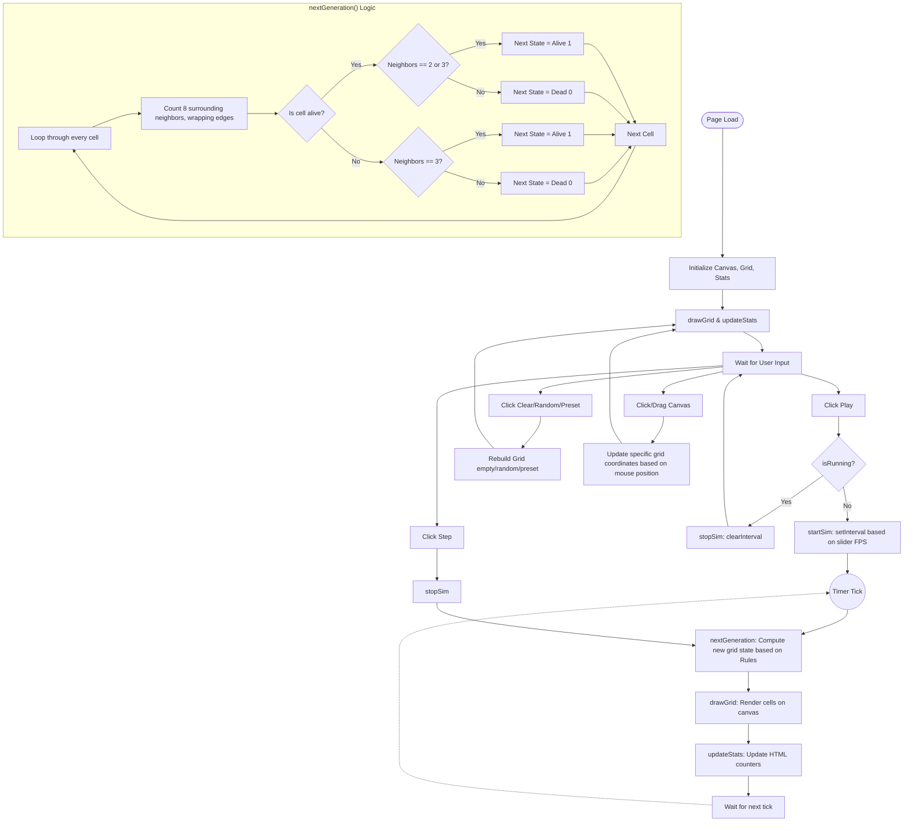

# Conway's Game of Life Implementation Analysis

## Overview
This file (`index.html`) is a standalone HTML file that implements Conway's Game of Life, a famous cellular automaton devised by mathematician John Horton Conway in 1970. It uses vanilla HTML, CSS, and JavaScript, rendering the grid on an HTML5 `<canvas>` element.

The Game of Life is a "zero-player game," meaning its evolution is determined entirely by its initial state. The simulation happens on a 2D grid of "cells," each of which is in one of two possible states: alive (1) or dead (0).

## Core Concepts & Rules
Every cell interacts with its eight neighbors (horizontal, vertical, and diagonal). At each step in time (a "generation"), the following transitions occur:

1.  **Survival:** Any live cell with 2 or 3 live neighbors survives to the next generation.
2.  **Death (Underpopulation):** Any live cell with fewer than 2 live neighbors dies.
3.  **Death (Overpopulation):** Any live cell with more than 3 live neighbors dies.
4.  **Birth (Reproduction):** Any dead cell with exactly 3 live neighbors becomes a live cell.

## Code Structure Breakdown

### 1. HTML & CSS (Lines 1-137)
*   **Styling:** A clean, minimal UI using monospace fonts and basic flexbox layouts.
*   **Canvas (`<canvas id="canvas">`):** The drawing board where the grid is rendered.
*   **Controls:** Buttons to Play/Pause, Step (move forward one generation), Clear the board, and randomize the grid.
*   **Speed Slider (`<input type="range">`):** Controls the frame rate of the simulation.
*   **Stats:** Displays the current generation number and the count of alive cells.
*   **Presets:** Buttons to inject famous Life patterns (Glider, Blinker, Pulsar, Glider Gun) onto the board.

### 2. Setup and State Variables (Lines 139-158)
*   `CELL_SIZE`, `COLS`, `ROWS`: Constants defining a grid of 60 columns by 45 rows, where each cell is 12x12 pixels.
*   `grid`: A 2D array (array of arrays) representing the current state of the board. `0` means dead, `1` means alive.
*   `isRunning`, `generation`, `simInterval`, `isDrawing`, `drawValue`: Variables tracking whether the simulation is running, the generation count, the ID of the `setInterval` timer, and mouse drag state for drawing.

### 3. Event Listeners (Lines 160-216)
*   **Control Buttons:** Standard click handlers to toggle play state, step forward, clear, and randomize. When clearing or randomizing, the simulation is stopped (`stopSim()`), the grid is rebuilt, and the screen is redrawn.
*   **Mouse Drawing:** Handlers for `mousedown`, `mousemove`, `mouseup`, and `mouseleave` on the canvas. These allow the user to click and drag to paint cells onto the grid. `getCellFromMouse` calculates which row/column corresponds to the clicked pixel coordinates.

### 4. Grid Management (Lines 218-240)
*   `createEmptyGrid()`: Initializes a 60x45 2D array filled with `0`s.
*   `createRandomGrid()`: Initializes a 2D array where each cell has a 25% chance (`Math.random() < 0.25`) of starting alive (`1`).

### 5. The Core Logic: Next Generation (Lines 242-280)
This is the heart of the Game of Life.
*   `nextGeneration()`:
    1.  Creates a temporary blank grid (`next`).
    2.  Loops through every single cell in the current `grid`.
    3.  Calls `countNeighbors(r, c)` to find out how many live neighbors the cell has.
    4.  Applies Conway's rules (Survival, Birth, Death) to determine the cell's state in the `next` grid.
    5.  Replaces the old `grid` with the `next` grid and increments the generation counter.
*   `countNeighbors(row, col)`:
    *   Loops through the 3x3 block surrounding the target cell (`dr` and `dc` from -1 to 1).
    *   Skips the center cell itself (`dr === 0 && dc === 0`).
    *   **Crucial Feature - Toroidal Array (Wrap-around):** It uses modulo arithmetic `(row + dr + ROWS) % ROWS` to calculate indices. This means if a cell goes off the right edge, it "wraps around" and appears on the left edge. The top and bottom edges are similarly connected.

### 6. Rendering (Lines 282-323)
*   `drawGrid()`:
    1.  Clears the canvas with a white background.
    2.  Draws a light gray grid using `ctx.moveTo` and `ctx.lineTo`.
    3.  Loops through the `grid` array. If a cell is `1`, it draws a dark gray filled rectangle (`ctx.fillRect`) slightly smaller than the cell size to leave the grid lines visible.
*   `updateStats()`: Counts all `1`s in the grid and updates the HTML text content for generation count and alive cells.

### 7. Simulation Control (Lines 325-345)
*   `startSim()`: Sets `isRunning = true`. Uses `setInterval` to repeatedly call `nextGeneration()`, `drawGrid()`, and `updateStats()`. The delay is calculated based on the speed slider's frames-per-second (fps) value (`1000 / fps`).
*   `stopSim()`: Uses `clearInterval(simInterval)` to halt the automatic generation loop.

### 8. Presets (Lines 347-386)
*   `PRESETS`: An object storing arrays of `[row_offset, col_offset]` pairs for famous patterns.
*   `placePreset(name)`: Stops the simulation, takes a preset array, and applies those `1`s relative to the center of the grid (except for the Glider Gun, which is placed specifically in the top-left to allow it room to shoot).

---

## Process Flowchart

